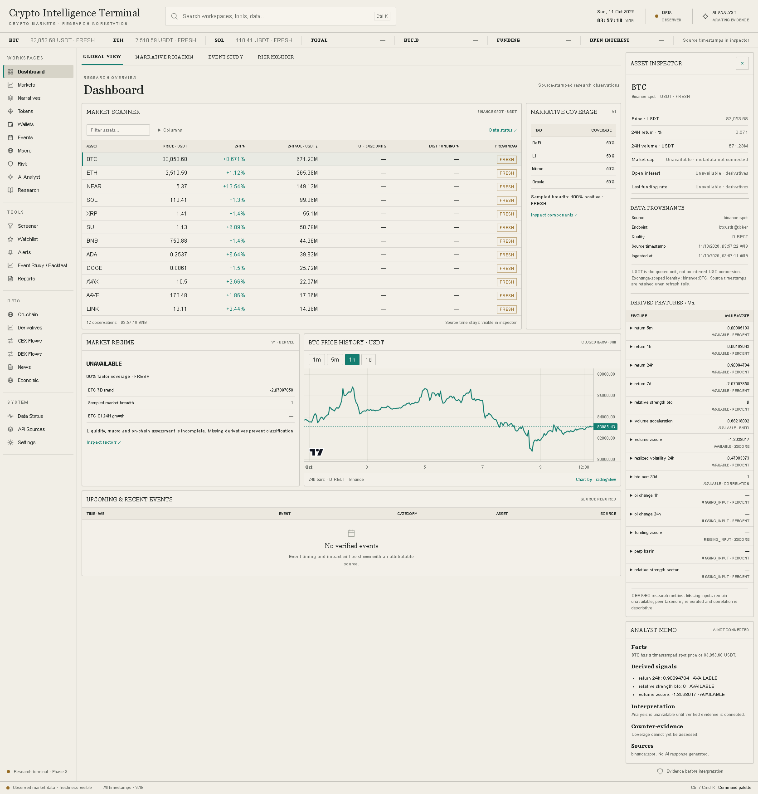
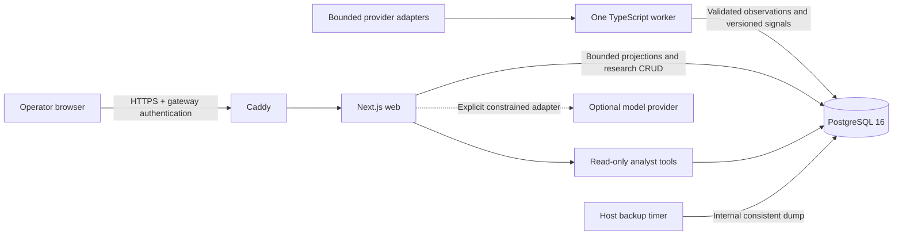

# Crypto Intelligence Terminal

An AI-native crypto intelligence research terminal combining market structure,
narrative rotation, on-chain activity, event analysis, risk monitoring, and
evidence-grounded research.



[Markets and inspector](design/phase8-markets.png) · [Mobile research](design/phase8-mobile.png) ·
[Secured operations](design/phase8-operations.png). Captures use actual local data;
the operations image is isolated local QA, not a VPS or off-host backup.

## Why it exists

Research is harder when prices, on-chain evidence and macro releases live in
separate tools with incompatible clocks and unexplained scores. This personal
terminal brings bounded observations and research records into one workspace,
with visible provenance, missing inputs and counter-evidence. It does not promise
trading alpha or turn activity into claims of profitability or wallet ownership.

## Capabilities

The market core provides a bounded Binance spot stream, persisted closed candles,
a sortable scanner, asset inspection, provenance, price charts, and independent
funding/open-interest adapters. Provider failures and stale observations remain
visible. The narrative matrix exposes curated membership, partial coverage,
component weights and counter-evidence. The asset inspector explains fourteen
versioned derived features. Breadth and regime require sufficient evidence.
Tokens and Risk provide a bounded DEX liquidity scanner, provider evidence,
four separate risk categories and a transparent liquidity-vacuum proxy.
Missing history, unsupported authorities and ownership relationships stay
unavailable. [Token methodology](docs/token-risk.md) explains inputs and limits.

Wallets provides bounded Solana address research: activity/transfers, operator
labels, descriptive behavior, transaction-supported relationships, and inspectable
reputation components. Helius credentials and an explicit address list are required
for live ingestion; absent evidence remains unavailable and reputation scores stay
uncalibrated. [Wallet methodology](docs/wallet-intelligence.md) documents the limits.
[Methodologies](docs/methodologies.md) documents formulas and limits.
Events and Macro expose sourced releases, observed FRED revisions, bounded impact
windows, rolling correlation, beta and lead/lag research. Missing evidence stays
unavailable and statistical associations never establish causation.
[Events/macro methodology](docs/events-macro.md) explains timing and sample limits.
The approved reference is a design direction; its illustrative values are never
used as market data.

## Architecture

Caddy fronts a Next.js application. One TypeScript worker runs bounded operational
heartbeats and ingestion against PostgreSQL 16. Drizzle owns migrations; shared Zod contracts
validate configuration, provenance, and provider health. PostgreSQL remains
internal in the full Compose stack. No Redis or additional runtime service is
required.



Next.js 16/React 19, strict TypeScript, Node 24, pnpm workspaces, Zod contracts,
Drizzle migrations, PostgreSQL 16, TanStack Query/Table, Vitest and Playwright.
Host backup/migration commands are one-off operations, not extra runtime services.

The UI follows the approved ivory palette, compact tables, restrained accents,
left navigation, and right inspector. The command palette opens with Ctrl/Cmd K
or `/` and supports arrow keys, Enter, and Escape.

## Local preview

Requires Node.js 24 and pnpm 10.33.0. The shell runs without credentials:

```sh
pnpm install --frozen-lockfile
pnpm dev
```

Open <http://127.0.0.1:3000>. Unconfigured database and provider states stay visible.

## Local Docker stack

Copy `.env.example` to the ignored `.env` and set `POSTGRES_PASSWORD` to a newly
generated local password. All example values are deliberately blank. Docker
Desktop must be running.

```sh
docker compose build worker
docker compose build web
docker compose build postgres
docker compose build caddy
docker compose up -d --wait
```

Open <http://127.0.0.1:8080>. `/health` reports liveness; `/health?ready=1` returns
503 until the database and worker are ready. The named database volume survives
container recreation. [Development and database setup](docs/deployment.md)
explains the loopback-only database override and host development workflow.

## Testing

```sh
pnpm qa
pnpm db:check
pnpm test:integration
pnpm exec playwright install chromium
pnpm test:e2e
```

`pnpm qa` checks formatting, lint, strict types, unit tests, and the production
build. Integration tests additionally require the local disposable database
`terminal_test` and `TEST_DATABASE_URL`; see [setup](docs/deployment.md#integration-tests).
They reset only that guarded test database. Browser tests launch the production
server and exercise navigation, keyboard controls, empty/error states, and layouts.

GitHub Actions runs these checks plus fresh Docker builds, secured HTTPS,
database-role permissions, protection, persistence and a real dump/restore gate.
`node infra/ops/verify-production.mjs` runs the isolated operational verifier
against loopback HTTPS and separate data. Fixtures remain test-only.
The [Phase 0 QA report](docs/qa-report.md), [Phase 1 review](docs/qa/phase-1.md)
and [Phase 2 review](docs/qa/phase-2.md), followed by [Phase 3](docs/qa/phase-3.md)
and [Phase 4](docs/qa/phase-4.md), followed by [Phase 5](docs/qa/phase-5.md)
and [Phase 6](docs/qa/phase-6.md), followed by [Phase 7](docs/qa/phase-7.md),
and [Phase 8](docs/qa/phase-8.md), record results and scope limitations.
The final local gate passes 157 unit, 73 PostgreSQL integration, 37 browser and
50 secured container/backup/recovery checks.
Production dependency audit is clean. One upstream development-tool advisory is
locally mitigated and documented in [dependency security](docs/dependency-security.md).

## Data and roadmap

| Provider              | Connection and current verification                                                                          |
| --------------------- | ------------------------------------------------------------------------------------------------------------ |
| Binance               | Bounded public spot REST/stream observed locally; funding/OI adapters tested, futures host locally times out |
| DEX Screener          | Selected pool aggregates every 15 minutes; public observations retained with collection time                 |
| GoPlus                | Bounded optional security evidence hourly; public observations retained, unsupported fields unavailable      |
| Helius                | Tracked Solana wallet adapter, four requests/day; key/address list absent, deterministic tests               |
| FRED                  | Twelve curated series and changed revisions hourly; key absent, deterministic tests                          |
| Optional AI model     | Explicit user-submitted read-only adapter; disabled without key/model, no live call verified                 |
| CoinGecko / DefiLlama | Not connected; no invented global/protocol metrics                                                           |

The [AI analyst](docs/ai-analyst.md) retrieves bounded read-only evidence and separates
facts, derived signals, interpretation, counter-evidence, confidence and sources.
Missing optional model credentials preserve the evidence brief and explicitly
withhold AI interpretation.

[Research workflow](docs/research-workflow.md) adds persistent watchlists,
operator notes, saved scanner views and structured queries, immutable evidence
reports and explainable in-app alerts. Missing inputs remain UNKNOWN; no automated
trading or external messaging exists. Report freshness is frozen at capture time.

The shared provenance contract distinguishes direct, aggregated, derived,
estimated, and AI-interpreted evidence. Derived and estimated values require a
methodology version. Missing evidence stays absent rather than becoming zero.
See [architecture](docs/architecture.md), [sources](docs/data-sources.md),
[provenance](docs/data-provenance.md), and [reliability](docs/reliability.md).

The authoritative brief is preserved in `docs/specification`. All eight phases
are implemented; phase PRs merge only after exact-head green QA/CI.
No VPS deployment has been performed. The default universe is 12 Binance USDT
spot markets (maximum 30); derivatives are independently unavailable when the
public futures endpoint cannot be reached. Tests use explicit fixtures, never
production seeds. See [market core](docs/market-core.md).
`PLAN.md`, `STATUS.md`, and `BLOCKERS.md` record the current phase and limitations.

## Reliability and production preparation

Target: Ubuntu, 2 vCPU, 2 GB RAM, 40 GB disk. Production uses prebuilt pinned images,
Caddy automatic HTTPS, one authenticated operator, restricted runtime database
roles and a 1,300 MiB aggregate container memory cap. The existing worker monitors
capacity and performs credential-independent retention. Storage warns at 70%, is
urgent at 80% and protects ingestion at 90%; database size warns at 6 GiB and
protects at 8 GiB. Missing/stale measurements fail closed for production writes.
Retained reads, heartbeat and cleanup continue. Logs and research storage are bounded.

Backups select seven daily, four weekly and three monthly buckets under a bounded
archive budget. **Same-disk backups are not disaster recovery.** Transfer them to
independent secured storage and verify a clean-host restore. See
[operations/security](docs/production-operations.md),
[deployment](docs/deployment.md) and [recovery](docs/disaster-recovery.md).
No VPS deployment, public certificate or off-host recovery has been performed.
Local measurements do not certify maximum VPS capacity. See the
[measured resource/storage review](docs/resource-review.md).

Missing Helius/FRED/model credentials, sourced event records, exact TOTAL3/DXY/gold,
execution-depth/LP evidence and global metadata remain explicit. CEX/DEX flow and
news placeholders do not imply connected feeds. Alerts are in-app and minute-based;
there is no external delivery, multi-user permission model or MFA. No trading
execution, wallet signing or private-key handling exists. Practical next steps are
operator-authorized deployment, off-host recovery, optional credentials and measured
tuning on the actual VPS. Additional feeds require their own bounded scope and evidence.
