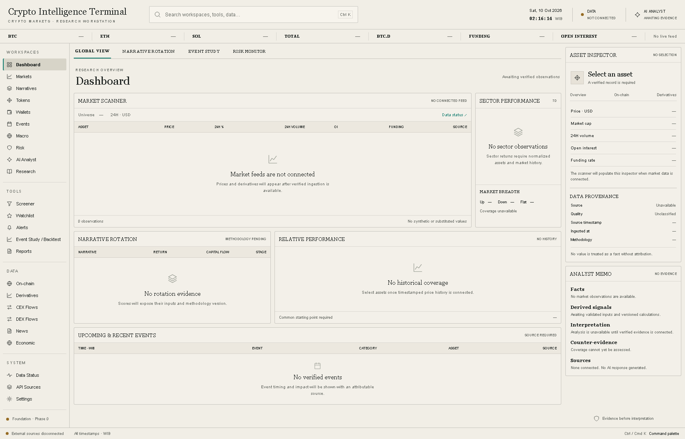

# Crypto Intelligence Terminal

An evidence-first crypto research workstation for market structure, narratives,
wallets, events, macro, and risk.



Phase 0 provides the terminal shell and engineering foundation. Navigation,
keyboard command search, runtime health, and explicit empty states work. Market
providers, asset selection, charts, scores, and AI analysis await later phases.
The approved reference is a design direction; its illustrative values are never
used as market data.

## Architecture

Caddy fronts a Next.js application. One TypeScript worker runs bounded operational
heartbeats against PostgreSQL 16. Drizzle owns migrations; shared Zod contracts
validate configuration, provenance, and provider health. PostgreSQL remains
internal in the full Compose stack. No Redis or additional runtime service is
required.

The UI follows the approved ivory palette, compact tables, restrained accents,
left navigation, and right inspector. The command palette opens with Ctrl/Cmd K
or `/` and supports arrow keys, Enter, and Escape.

## Local preview

Requires Node.js 24 and pnpm 10.33.0. The shell runs without credentials:

```sh
pnpm install --frozen-lockfile
pnpm dev
```

Open <http://127.0.0.1:3000>. Unconfigured database and provider states stay visible.

## Local Docker stack

Copy `.env.example` to the ignored `.env` and set `POSTGRES_PASSWORD` to a newly
generated local password. All example values are deliberately blank. Docker
Desktop must be running.

```sh
docker compose build worker
docker compose build web
docker compose up -d --wait
```

Open <http://127.0.0.1:8080>. `/health` reports liveness; `/health?ready=1` returns
503 until the database and worker are ready. The named database volume survives
container recreation. [Development and database setup](docs/deployment.md)
explains the loopback-only database override and host development workflow.

## Testing

```sh
pnpm qa
pnpm db:check
pnpm test:integration
pnpm exec playwright install chromium
pnpm test:e2e
```

`pnpm qa` checks formatting, lint, strict types, unit tests, and the production
build. Integration tests additionally require the local disposable database
`terminal_test` and `TEST_DATABASE_URL`; see [setup](docs/deployment.md#integration-tests).
They reset only that guarded test database. Browser tests launch the production
server and exercise navigation, keyboard controls, empty/error states, and layouts.

GitHub Actions runs these checks plus a fresh Docker build and readiness test.
The [Phase 0 QA report](docs/qa-report.md) records results and scope exclusions.
Production dependency audit is clean. One upstream development-tool advisory is
locally mitigated and documented in [dependency security](docs/dependency-security.md).

## Data and roadmap

The shared provenance contract distinguishes direct, aggregated, derived,
estimated, and AI-interpreted evidence. Derived and estimated values require a
methodology version. Missing evidence stays absent rather than becoming zero.
See [architecture](docs/architecture.md), [sources](docs/data-sources.md),
[provenance](docs/data-provenance.md), and [reliability](docs/reliability.md).

The authoritative brief is preserved in `docs/specification`. Phase 1 will add
the market core only after approval. No VPS deployment has been performed.
`PLAN.md`, `STATUS.md`, and `BLOCKERS.md` record the current phase and limitations.
