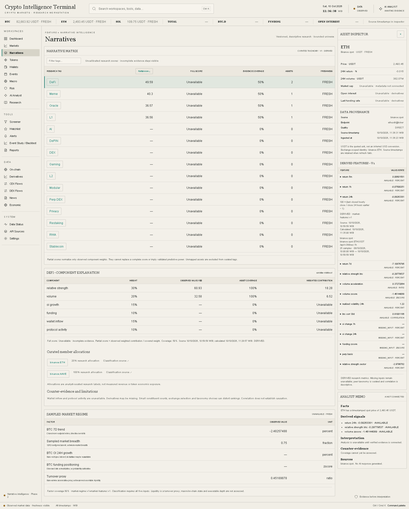

# Crypto Intelligence Terminal

An evidence-first crypto research workstation for market structure, narratives,
wallets, events, macro, and risk.



The market core provides a bounded Binance spot stream, persisted closed candles,
a sortable scanner, asset inspection, provenance, price charts, and independent
funding/open-interest adapters. Provider failures and stale observations remain
visible. The narrative matrix exposes curated membership, partial coverage,
component weights and counter-evidence. The asset inspector explains fourteen
versioned derived features. Breadth and regime require sufficient evidence.
Tokens and Risk provide a bounded DEX liquidity scanner, provider evidence,
four separate risk categories and a transparent liquidity-vacuum proxy.
Missing history, unsupported authorities and ownership relationships stay
unavailable. [Token methodology](docs/token-risk.md) explains inputs and limits.

Wallets provides bounded Solana address research: activity/transfers, operator
labels, descriptive behavior, transaction-supported relationships, and inspectable
reputation components. Helius credentials and an explicit address list are required
for live ingestion; absent evidence remains unavailable and reputation scores stay
uncalibrated. [Wallet methodology](docs/wallet-intelligence.md) documents the limits.
[Methodologies](docs/methodologies.md) documents formulas and limits.
Events and Macro expose sourced releases, observed FRED revisions, bounded impact
windows, rolling correlation, beta and lead/lag research. Missing evidence stays
unavailable and statistical associations never establish causation.
[Events/macro methodology](docs/events-macro.md) explains timing and sample limits.
The approved reference is a design direction; its illustrative values are never
used as market data.

## Architecture

Caddy fronts a Next.js application. One TypeScript worker runs bounded operational
heartbeats and ingestion against PostgreSQL 16. Drizzle owns migrations; shared Zod contracts
validate configuration, provenance, and provider health. PostgreSQL remains
internal in the full Compose stack. No Redis or additional runtime service is
required.

The UI follows the approved ivory palette, compact tables, restrained accents,
left navigation, and right inspector. The command palette opens with Ctrl/Cmd K
or `/` and supports arrow keys, Enter, and Escape.

## Local preview

Requires Node.js 24 and pnpm 10.33.0. The shell runs without credentials:

```sh
pnpm install --frozen-lockfile
pnpm dev
```

Open <http://127.0.0.1:3000>. Unconfigured database and provider states stay visible.

## Local Docker stack

Copy `.env.example` to the ignored `.env` and set `POSTGRES_PASSWORD` to a newly
generated local password. All example values are deliberately blank. Docker
Desktop must be running.

```sh
docker compose build worker
docker compose build web
docker compose up -d --wait
```

Open <http://127.0.0.1:8080>. `/health` reports liveness; `/health?ready=1` returns
503 until the database and worker are ready. The named database volume survives
container recreation. [Development and database setup](docs/deployment.md)
explains the loopback-only database override and host development workflow.

## Testing

```sh
pnpm qa
pnpm db:check
pnpm test:integration
pnpm exec playwright install chromium
pnpm test:e2e
```

`pnpm qa` checks formatting, lint, strict types, unit tests, and the production
build. Integration tests additionally require the local disposable database
`terminal_test` and `TEST_DATABASE_URL`; see [setup](docs/deployment.md#integration-tests).
They reset only that guarded test database. Browser tests launch the production
server and exercise navigation, keyboard controls, empty/error states, and layouts.

GitHub Actions runs these checks plus a fresh Docker build and readiness test.
The [Phase 0 QA report](docs/qa-report.md), [Phase 1 review](docs/qa/phase-1.md)
and [Phase 2 review](docs/qa/phase-2.md), followed by [Phase 3](docs/qa/phase-3.md)
and [Phase 4](docs/qa/phase-4.md), followed by [Phase 5](docs/qa/phase-5.md)
and [Phase 6](docs/qa/phase-6.md), followed by [Phase 7](docs/qa/phase-7.md),
record results and scope limitations.
Production dependency audit is clean. One upstream development-tool advisory is
locally mitigated and documented in [dependency security](docs/dependency-security.md).

## Data and roadmap

The [AI analyst](docs/ai-analyst.md) retrieves bounded read-only evidence and separates
facts, derived signals, interpretation, counter-evidence, confidence and sources.
Missing optional model credentials preserve the evidence brief and explicitly
withhold AI interpretation.

[Research workflow](docs/research-workflow.md) adds persistent watchlists,
operator notes, saved scanner views and structured queries, immutable evidence
reports and explainable in-app alerts. Missing inputs remain UNKNOWN; no automated
trading or external messaging exists. Report freshness is frozen at capture time.

The shared provenance contract distinguishes direct, aggregated, derived,
estimated, and AI-interpreted evidence. Derived and estimated values require a
methodology version. Missing evidence stays absent rather than becoming zero.
See [architecture](docs/architecture.md), [sources](docs/data-sources.md),
[provenance](docs/data-provenance.md), and [reliability](docs/reliability.md).

The authoritative brief is preserved in `docs/specification`. Phase 0 is approved
and merged; Phases 1–8 are authorized sequentially after each green QA/CI gate.
No VPS deployment has been performed. The default universe is 12 Binance USDT
spot markets (maximum 30); derivatives are independently unavailable when the
public futures endpoint cannot be reached. Tests use explicit fixtures, never
production seeds. See [market core](docs/market-core.md).
`PLAN.md`, `STATUS.md`, and `BLOCKERS.md` record the current phase and limitations.
